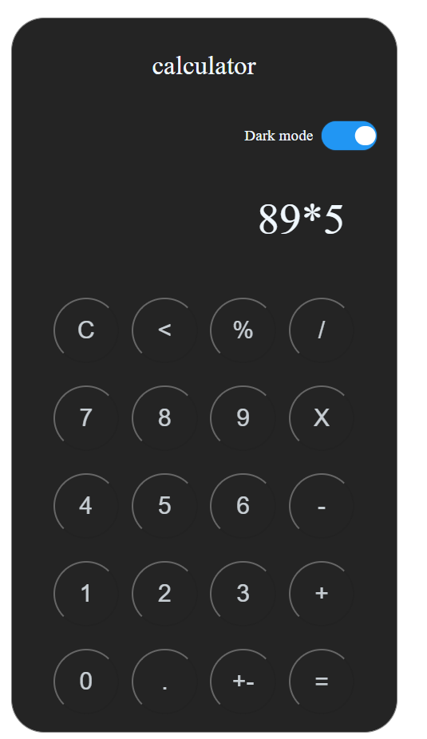
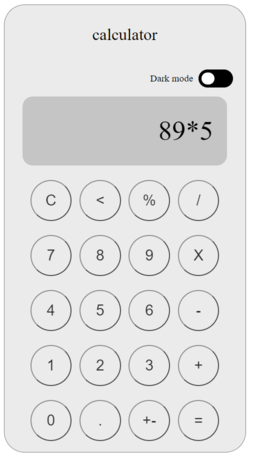
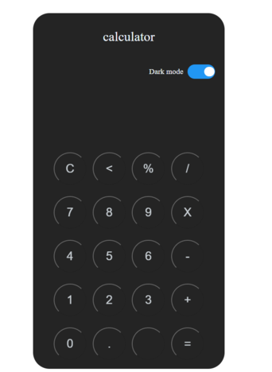

# calculator
Calculadora desenvolvida como os principais cálculos aritméticos.

## 📦 Tecnologias utilizadas para construção:

- HTML5 -  Como linguagem de marcação.
- CSS3  -  Para estilização de todos os componentes.  
- Javascript - Para efetuar os calculos e interações.


## 🖥 Preview do projeto 





## 📋 Pré-requisitos
Você precisa de um navegador instalado em seu computador. Recomenda-se o uso do 
Antes de qualquer coisa, você precisa ter instaldo o [Google Chrome](https://www.google.com/intl/pt-BR/chrome) e [Git](https://git-scm.com/downloads). Para Instalar o siga o passo a passo de cada link listado abaixo:


## 🔧 Como rodar a página

Abra o terminal Git Bash no diretorio em que deseja salvar o projeto e cole o seguinte comando:
 
```
https://github.com/Irisjunior/calculator.git
```


*Pronto, todos os arquivos necessários para a execução estarão na pasta imobiliaria criada no diretorio selecionado. Para rodar o projeto basta abrir o arquivo `Index.html`*   <br/>
